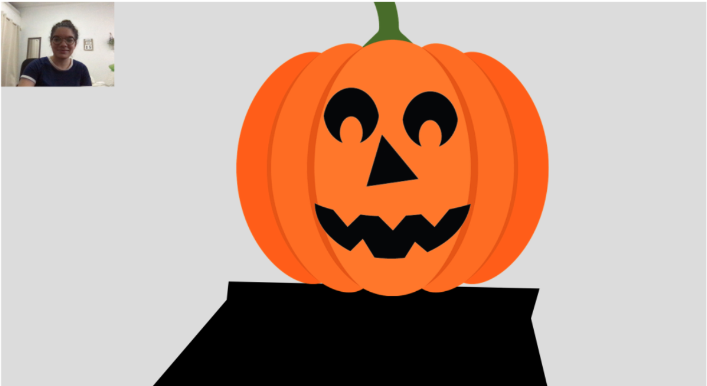

# Dancing-Halloween-Character
A web app that allows users to become their own dancing pumpkin character using machine learning models!
<a href="https://jlizardo019.github.io/Generative-Art/">Try it out!</a>

## Summary
A web app that allows users to become their own dancing pumpkin character by using ml5.js Posenet model to detect your body from your webcam and move the character on the canvas. The character scales according to the distance between the user and the camera by measuring the distance between the user's eyes. I reduced the noise introduced by the webcam by linear interpolation of the key points. Therefore, there is a slight lag in the responsiveness in order to make the movements look more smooth.

## Inspiration
It is October, which means Halloween is fast approaching! In the holiday spirit, I decided to recreate my favorite halloween gif: the dancing Halloween man. My friends and I always send this gif to each other whenever we are feeling down. I wanted the project to capture the silly nature of the dancing.

 

## License
Please reach out if you would like to fork this project or contribute to development. Include attribution in any work that stems from this!

## Author

* [Julie Lizardo](https://www.linkedin.com/in/julie-lizardo/)  -- [Web Developer](https://julielizardo.com/)
